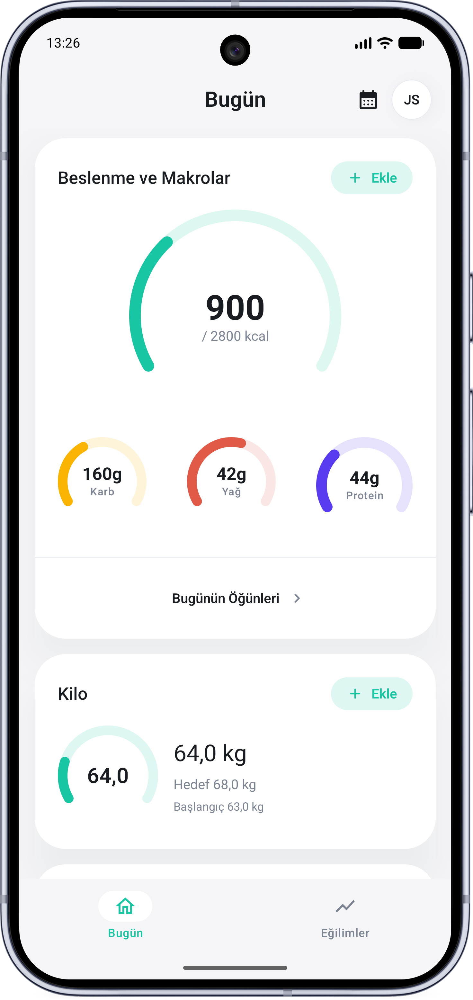
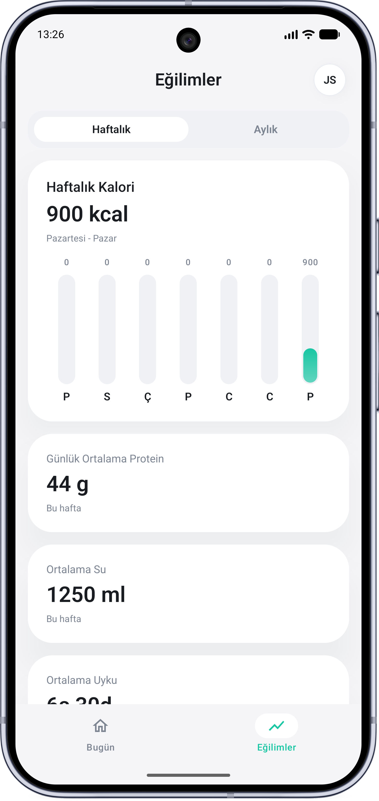
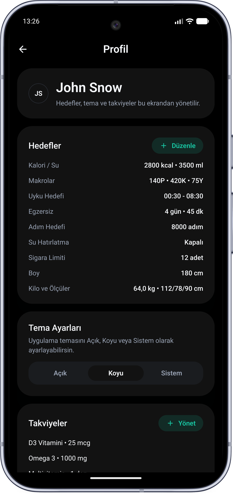
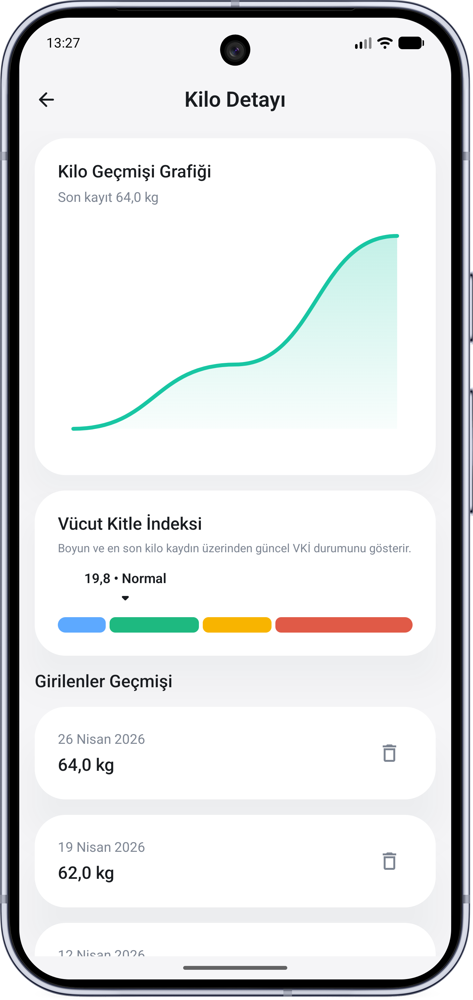
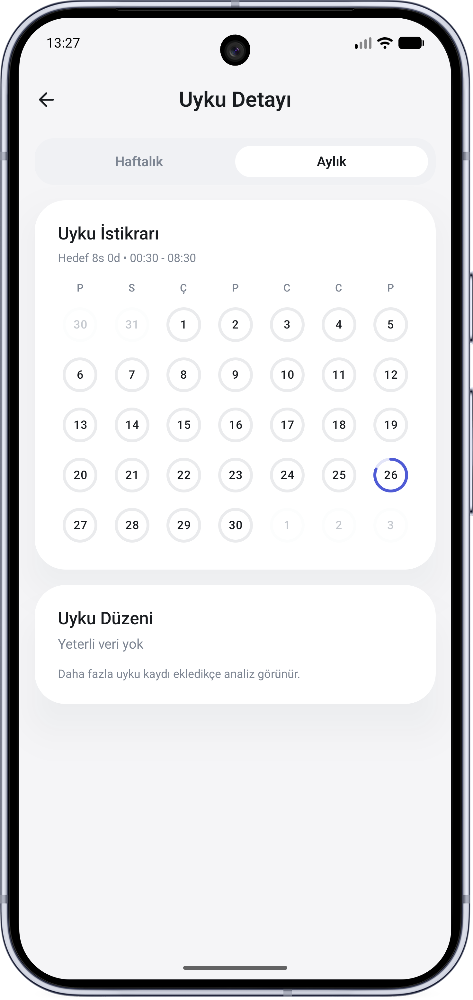
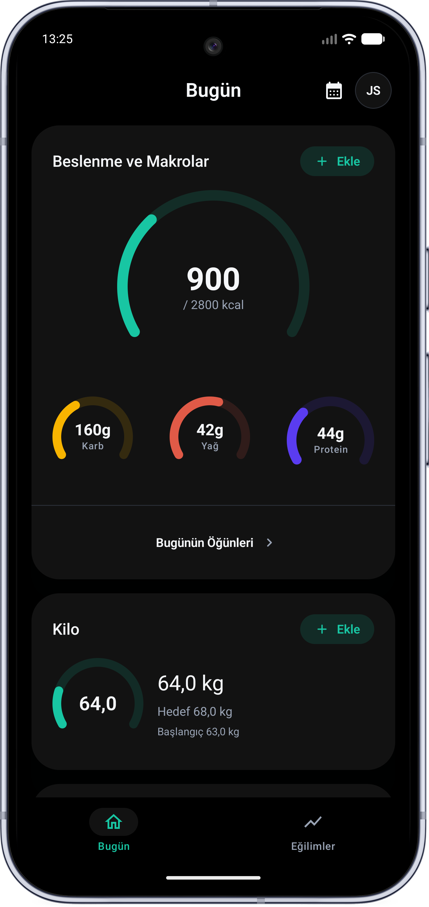

# Health_App


**Health_App**, Kotlin ve Jetpack Compose ile geliştirilmiş, local-first çalışan modern bir Android sağlık takip uygulamasıdır.

Uygulama; beslenme, makro, su tüketimi, uyku, kilo, vücut ölçüleri, egzersiz, sigara, takviye ve adım takibini tek bir günlük sağlık panelinde birleştirir. Veriler cihaz üzerinde saklanır ve uygulama kişisel sağlık alışkanlıklarını daha düzenli takip etmeye odaklanır.

> Bu proje tıbbi tavsiye vermek için değil, kişisel alışkanlık ve sağlık verisi takibini kolaylaştırmak için geliştirilmiştir.

---

## İçindekiler

- [Özellikler](#özellikler)
- [Ekran Görüntüleri](#ekran-görüntüleri)
- [Teknolojiler](#teknolojiler)
- [Mimari](#mimari)
- [Proje Yapısı](#proje-yapısı)
- [Veri Saklama ve Gizlilik](#veri-saklama-ve-gizlilik)
- [Veri Dışa Aktarma](#veri-dışa-aktarma)
- [Lokalizasyon](#lokalizasyon)
- [Kurulum](#kurulum)
- [Geliştirme Komutları](#geliştirme-komutları)
- [Testler](#testler)
- [Release ve Performans](#release-ve-performans)
- [Yol Haritası](#yol-haritası)
- [Lisans](#lisans)

---

## Özellikler

### Günlük sağlık paneli

- Günlük kalori ve makro takibi
- Protein, karbonhidrat ve yağ hedefleri
- Su tüketimi takibi
- Uyku süresi ve uyku hedefi
- Egzersiz kaydı
- Sigara sayacı
- Takviye/doz takibi
- Kilo ve vücut ölçüsü takibi
- Günlük adım takibi
- Kafein takibi (hızlı ekleme, günlük limit, kesme saati farkındalığı)
- Kafein detay ekranında haftalık/aylık grafikler ve kayıt listesi
- Sigara detay ekranında haftalık/aylık grafikler, özetler ve dönem geçmişi
- Egzersiz detay ekranında haftalık/aylık grafikler, toplam süre ve dönem geçmişi
- Su ve kafein kartlarında tutarlı kalın progress göstergeleri
- Büyük metrik sayılarında cihaz diline uygun binlik ayırıcılar
- Sigara kartında progress yerine durum odaklı dolu daire göstergesi
- Ana ekran kartlarını göster/gizle ve sürükleyerek sıralama desteği (Beslenme, Kilo, Egzersiz, Adım, Kafein, Su, Uyku, Sigara, Takviyeler)
- Compact telefon, landscape ve tablet ekranlar için adaptive dashboard, profil ve detay ekran düzenleri

### Beslenme ve makro takibi

- Öğün bazlı yiyecek girişi
- Hazır besin arama ve kalori/makro değerlerini otomatik doldurma
- Kalori, protein, karbonhidrat ve yağ takibi
- Günlük hedeflere göre ilerleme göstergeleri
- Öğün geçmişi ekranı

### Su takibi ve hatırlatıcılar

- Hızlı su ekleme
- Günlük su hedefi
- WorkManager tabanlı su hatırlatıcı sistemi
- Hatırlatıcı başlangıç, bitiş ve aralık ayarları
- Hatırlatıcılar seçilen zaman penceresindeki bir sonraki uygun aralığa hizalanır
- Bildirim üzerinden 250 ml su ekleme veya bugünkü hatırlatmaları susturma
- WorkManager pil dostu çalışır; dakikası dakikasına alarm garantisi vermez

### Uyku takibi

- Uyku başlangıç ve bitiş saati kaydı
- Günlük uyku süresi
- Uyku hedefi
- Uyku detay ekranı

### Adım takibi

- Android `TYPE_STEP_COUNTER` sensörü ile adım sayımı
- Foreground service tabanlı takip
- Profil sekmesinden kullanıcı açıkça etkinleştirirse arka planda çalışır
- Foreground bildirimindeki “Durdur” aksiyonu ile kapatılabilir
- Günlük adım hedefi
- Haftalık ve aylık adım trendleri

### Kilo ve vücut ölçüleri

- Kilo kaydı
- Omuz, bel ve kalça ölçüleri
- Hedef kiloya göre ilerleme
- Kilo trend grafikleri

### Profil ve hedefler

- Kullanıcı adı ve avatar baş harfleri
- Günlük kalori, makro, su, uyku, adım, egzersiz ve sigara hedefleri
- Tema seçimi
- Takviye listesi düzenleme

### Tema desteği

- Açık tema
- Koyu tema
- AMOLED uyumlu siyah arka plan
- Sistem temasını takip etme

---

## Ekran Görüntüleri

| Bugün | Trendler | Profil |
|---|---|---|
|  |  |  |

| Kilo Detayı | Uyku Detayı | Koyu Tema |
|---|---|---|
|  |  |  |

---

## Teknolojiler

- **Kotlin**
- **Jetpack Compose**
- **Material 3**
- **Navigation Compose**
- **Room**
- **DataStore**
- **WorkManager**
- **Kotlin Coroutines / Flow**
- **Lifecycle ViewModel**
- **Hilt**
- **KSP**
- **Vico Charts**
- **JUnit**
- **AndroidX Test**
- **Compose UI Test**

---

## Mimari

Health_App, küçük ve stabil bir ilk multi-module mimari kullanır. Feature ekranları `:app` içinde kalırken saf iş kuralları `:domain`, Room/DataStore veri katmanı `:data`, ortak Compose bileşenleri ise `:core:ui` modülüne ayrılmıştır.

Temel veri akışı:

```text
Compose UI
   ↓
ViewModel
   ↓
UseCase / Mapper
   ↓
Repository Interface
   ↓
Repository Implementation
   ↓
Room / DataStore / WorkManager / Android Sensor APIs
````

Mimari hedefler:

* UI, domain ve data sorumluluklarını ayırmak
* ViewModel içinde Android `Context` bağımlılığını azaltmak
* Repository, database, DataStore ve use case bağımlılıklarını Hilt üzerinden sağlamak
* Uygulama metinlerini lokalizasyona hazır hale getirmek
* Compact, medium ve expanded ekranlarda ortak adaptive UI kararları kullanmak
* Varsayılan hedef değerlerini merkezi sabitler üzerinden yönetmek
* Test edilebilir, okunabilir ve sürdürülebilir bir yapı kurmak

---

## Proje Yapısı

```text
:app
├── MainActivity.kt / HealthApplication.kt
├── core/di, core/notification, core/reminder, core/step
└── feature/app, root, onboarding, today, trends, profile, detail

:domain
├── calculation
├── config
├── export
├── model
├── repository
├── usecase
└── validation

:data
├── core/database
├── core/datastore
├── data/export
├── data/local/dao, entity, mapper
└── data/repository

:core:ui
├── components
├── model
├── navigation
├── text
└── theme

:benchmark
└── macrobenchmark ve baseline profile senaryoları
```

### Katmanlar

#### `:app`

Uygulama giriş noktası, navigation, feature ekranları, platform servisleri ve Hilt module tanımlarını içerir.

Örnekler:

* Bildirim altyapısı
* WorkManager hatırlatıcıları
* Adım takibi foreground service
* Hilt module tanımları

#### `:domain`

Android framework bağımlılığı olmayan iş kurallarını içerir.

Örnekler:

* Domain modelleri
* Repository interface’leri
* Hesaplama fonksiyonları
* Varsayılan sağlık hedefleri
* Use case sınıfları
* Validation modelleri

#### `:data`

Veri kaynakları ve repository implementasyonlarını içerir.

Örnekler:

* Room entity’leri
* DAO sınıfları
* Database tanımı
* DataStore kurulumu
* Mapper fonksiyonları
* Repository implementasyonları

#### `:core:ui`

Ortak Compose UI bileşenleri, tema sistemi, route destination tanımları ve UI text helper'larını içerir.

#### `feature`

Ekran ve kullanıcı akışlarını içerir.

Örnekler:

* Today dashboard
* Trends ekranı
* Profile ekranı
* Onboarding
* Kilo, uyku, adım ve öğün detay ekranları

---

## Veri Saklama ve Gizlilik

Health_App, local-first bir uygulamadır.

* Veriler cihaz üzerinde saklanır.
* Ana veri kaynağı Room veritabanıdır.
* Kullanıcı ayarları DataStore ile tutulur.
* Uygulamada varsayılan olarak uzak sunucu veya backend entegrasyonu bulunmaz.
* Sağlık verileri hassas veri olarak kabul edilir.
* Otomatik Android cloud backup devre dışıdır; `health.db` ve `health_preferences` DataStore dosyası backup/data extraction kurallarında ayrıca dışarıda tutulur.
* Cihazlar arası senkronizasyon, backend aktarımı veya otomatik bulut yedekleme varsayılan davranış değildir.
* Profil > Veri Yönetimi üzerinden kullanıcı kontrollü JSON dışa/içe aktarma desteği vardır; dışa aktarılan dosya hassas sağlık verisi içerir ve kullanıcının seçtiği konuma yazılır.
* İçe aktarma onay önizlemesiyle çalışır; kullanıcı onay vermeden veritabanına yazma yapılmaz.
* Tüm sağlık kayıtlarını silme işlemi ayrı onay ister; profil adı, tema, onboarding ve hedef ayarları korunur.
* Su hatırlatıcı ve adım takibi tercihleri Profil sekmesinden yönetilir; bildirim izni yalnız kullanıcı hatırlatıcıyı açtığında istenir.
* Su hatırlatıcı bildirimleri yalnız kullanıcı etkinleştirirse ve bildirim izni açıksa gösterilir; bildirimden hızlı su ekleme veya gün sonuna kadar susturma yapılabilir.
* Bu uygulama tıbbi tavsiye vermez ve tıbbi karar destek sistemi olarak kullanılmamalıdır.

---

## Veri Dışa Aktarma

Profil ekranındaki Veri Yönetimi bölümü, kullanıcının seçtiği dosya konumuna JSON formatında dışa aktarma ve seçtiği JSON dosyasından içe aktarma yapar.

* Export dosyası `schemaVersion` alanı ile versiyonlanır ve güncel şema sürümü `2` değerini kullanır.
* `exportedAt` ISO-8601 zaman damgası, `appVersion` ise uygulama sürüm bilgisini içerir.
* Profil, hedefler, su hatırlatma ayarları, tema modu ve local Room kayıtları tek JSON kök modeli altında toplanır.
* Uygulama dosya konumunu otomatik seçmez; Android Storage Access Framework ile kullanıcıdan konum seçimi alınır.
* İçe aktarma `schemaVersion = 1` ve `schemaVersion = 2` dosyalarını kabul eder; yazmadan önce kayıt sayılarını gösteren bir önizleme sunar.
* `schemaVersion = 2` ile kafein kayıtları da export/import kapsamına alınır.
* JSON export/import dosyası sağlık verisi içerdiği için güvenilir konumlarda saklanmalıdır.

Import transaction içinde uygulanır; kısmi import başarısız olursa Room kayıtları yarım bırakılmaz.

---

## Lokalizasyon

Varsayılan kaynak dosyası Türkçe metinleri korur. İngilizce metinler `values-en/strings.xml` altında tutulur ve Android 13+ per-app language hazırlığı için `locales_config.xml` içinde `tr` ve `en` tanımlıdır.

Domain modülü Android resource, `Context`, Compose veya `stringResource` bağımlılığı taşımaz. Enum ve domain modelleri kullanıcıya görünen label bilmez; UI tarafı string resource mapper veya `UiText` ile metin üretir.

---

## Kurulum

Projeyi klonla:

```bash
git clone https://github.com/burakkayax/Health_App.git
cd Health_App
```

Android Studio ile aç:

```text
File > Open > Health_App
```

Gereksinimler:

* Android Studio güncel sürüm
* JDK 17
* Android SDK
* Minimum SDK: 26
* Target SDK: 36

---

## Geliştirme Komutları

Debug Kotlin derlemesi:

```bash
./gradlew :app:compileDebugKotlin
```

Unit testleri çalıştırma:

```bash
./gradlew :app:testDebugUnitTest
```

Domain unit testleri:

```bash
./gradlew :domain:test
```

Data module unit testleri:

```bash
./gradlew :data:test
```

Kotlin format kontrolü:

```bash
./gradlew spotlessCheck
```

Kotlin format uygulama:

```bash
./gradlew spotlessApply
```

Statik analiz:

```bash
./gradlew detekt
```

Android lint:

```bash
./gradlew lintDebug
```

Android test Kotlin derlemesi:

```bash
./gradlew :app:compileDebugAndroidTestKotlin
```

Debug APK oluşturma:

```bash
./gradlew :app:assembleDebug
```

Release APK oluşturma:

```bash
./gradlew :app:assembleRelease
```

Debug APK konumu:

```text
app/build/outputs/apk/debug/app-debug.apk
```

---

## Testler

Projede aşağıdaki test türleri hedeflenir:

* Domain calculation unit testleri
* Repository testleri
* Room migration testleri
* Import/export ve veri yönetimi testleri
* Validation ve form hata yönetimi unit testleri
* ViewModel testleri
* Compose UI testleri

Çalıştırma:

```bash
./gradlew :app:testDebugUnitTest
```

Android test derlemesi:

```bash
./gradlew :app:compileDebugAndroidTestKotlin
```

Benchmark derlemesi:

```bash
./gradlew :benchmark:assembleBenchmark
```

Connected benchmark çalıştırma:

```bash
./gradlew :benchmark:connectedBenchmarkAndroidTest
```

Connected benchmark için emulator veya fiziksel cihaz gerekir. Benchmark hedef uygulama varyantı release'e yakın optimize edilir, ancak test cihazına kurulabilmesi için yalnızca benchmark build type debug key ile imzalanır; production release imzası değişmez.

Benchmark navigation akışları `nav_today`, `nav_trends`, `nav_profile`, `today_list`, `trends_screen` ve `profile_screen` testTag selectorlarını öncelikli kullanır. Emulator sonuçları smoke/regression için uygundur; gerçek performans karşılaştırması için fiziksel cihaz tercih edilir.

Baseline profile üretimi:

```bash
./gradlew :benchmark:connectedBenchmarkAndroidTest
```

---

## Release ve Performans

Release build dağıtım kalitesi için R8 minification ve resource shrinking etkindir.

* Debug build hızlı iterasyon içindir.
* Release build optimize edilmiş APK üretir.
* CI, `:app:assembleRelease` adımını da doğrular.
* Baseline Profile dosyası `app/src/main/baseline-prof.txt` altında tutulur.
* Performans, pil ve kararlılık baseline audit notları `docs/performance-audit.md` dosyasında tutulur.
* PR23.6 ile dashboard ve detail ekran render maliyetleri azaltılmaya başlanmıştır.
* Adım takibi ve su hatırlatıcı, kullanıcı tercihi ve izinlere göre pil dostu arka plan guardları içerir.
* Connected benchmark doğrulaması emulator/fiziksel cihaz gerektirir; gerçek performans ölçümü için fiziksel cihaz tercih edilmelidir.
* Açılışta root loading metni yerine sakin arka plan, Today/Trends/detail initial yüklemede hafif skeleton yapılar kullanılır.

---

## Lokalizasyon

Kullanıcıya gösterilen metinler `res/values/strings.xml` içinde tutulur.

Hedefler:

* Hardcoded UI metinlerini azaltmak
* Türkçe metinleri merkezi yönetmek
* İleride İngilizce veya farklı dil desteğini kolaylaştırmak
* ViewModel içinde doğrudan Android `Context` kullanmadan metin üretmek

ViewModel kaynaklı hata ve validasyon mesajları için `UiText` yaklaşımı kullanılır.
Kullanıcı form girişleri için Android bağımsız validator sınıfları kullanılır; UI katmanı yalnız hata modelini string resource metnine çevirir.

---

## Varsayılan Hedefler

Uygulamadaki varsayılan sağlık hedefleri merkezi olarak yönetilir.

Örnek hedefler:

* Günlük kalori
* Protein, karbonhidrat ve yağ hedefleri
* Su hedefi
* Adım hedefi
* Uyku hedefi
* Egzersiz hedefi
* Sigara limiti
* Başlangıç ve hedef vücut ölçüleri

Bu değerler doğrudan ViewModel veya repository içinde tekrar edilmez; domain/config altında merkezi sabitlerden okunur.

---

## Yol Haritası

Planlanan geliştirmeler:

* [x] Hilt tabanlı dependency injection
* [x] Multi-module mimariye geçiş
* [ ] Health Connect entegrasyonu
* [ ] CSV/PDF raporlar
* [ ] Daha gelişmiş grafik ve trend analizleri
* [ ] Widget desteği
* [x] İngilizce dil desteği
* [x] Baseline Profile ve Macrobenchmark
* [ ] Kullanıcı kontrollü import önizleme geliştirmeleri ve veri yönetimi raporları
* [x] Release build optimizasyonları

---

## Bilinen Sınırlamalar

* Uygulama tıbbi karar destek sistemi değildir.
* Adım sayımı cihazdaki sensör desteğine ve kullanıcının adım takibini etkinleştirmesine bağlıdır.
* WorkManager tabanlı hatırlatıcılar kesin zamanlı alarm garantisi vermez.
* Geniş ekran desteği temel adaptive layout seviyesindedir; tam Material Expressive redesign ayrı bir gelecek PR konusu olarak kalır.
* Kafein kayıt saatini manuel düzenleme sonraki PR konusu olarak bırakılmıştır.
* Egzersiz ve sigara kayıtlarını düzenleme akışı sonraki PR konusu olarak bırakılmıştır.
* Veriler şu an local-first yapıdadır; cihazlar arası senkronizasyon yoktur.

---

## Katkı

Bu proje kişisel portfolyo ve öğrenme amacıyla geliştirilmiştir. İyileştirme önerileri, issue veya pull request olarak paylaşılabilir.

---

## Lisans

Bu proje için lisans bilgisi daha sonra eklenecektir.

---
